## Motivation {.smaller}

- **Mental health** is now a central pillar of U.S. public-health surveillance
- **Frequent Mental Distress (FMD)** = 14+ days of poor mental health in past 30 days
  - Captures meaningful psychological burden without a clinical diagnosis
  - Widely used CDC state-level surveillance indicator
- 2020–2024 spans the pandemic and post-pandemic period — a uniquely informative window
- **Goal:** produce a clear, layered *descriptive* picture of where mental distress is concentrated in U.S. adults

::: aside
No causal modeling — this report is descriptive.
:::

---

## Research Questions

1. How has **overall FMD prevalence** shifted through 2020–2024?
2. How does FMD vary **across U.S. states**, and is the pattern stable over time?
3. How is FMD patterned by **behavioral / psychosocial / lifestyle** factors?
   - exercise, loneliness, emotional support, smoking, drinking, general health
4. Which **demographic and socioeconomic** groups report the highest FMD?
   - age, sex, income, education, employment, marital status

---

## Data and Methods {.smaller}

- **Source:** CDC BRFSS annual survey files, 2020–2024 (`LLCP2020.XPT`–`LLCP2024.XPT`)
- **Primary outcome:** FMD, defined as `_MENT14D == 3`
- **Analytic sample**
  - 2,097,130 respondents with valid FMD (pooled 2020–2024)
  - 442,292 respondents for 2024 state-level snapshot
- **Coverage:** 50 states + DC (territories removed; Tennessee absent in 2024)
- **Harmonization:** income, doctor-cost, and alcohol variables aligned across cycles
- **Analysis style:** descriptive, unweighted, pairwise complete-case figures

---

## Figure 1 — Overall FMD prevalence, 2024

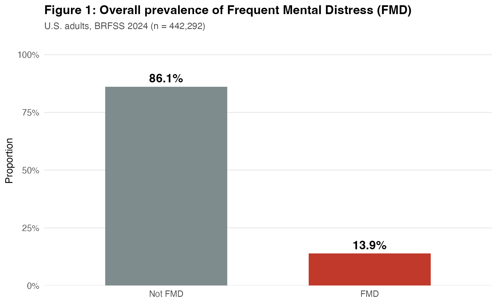{fig-align="center" width="70%"}

::: {.incremental}
- **13.9%** of U.S. adults met the FMD criterion in 2024 (n = 442,292)
- FMD affects a **substantial share** of adults — not a small exceptional group
- Sets the national baseline for every comparison that follows
:::

---

## Figure 2 — FMD trend, 2020–2024

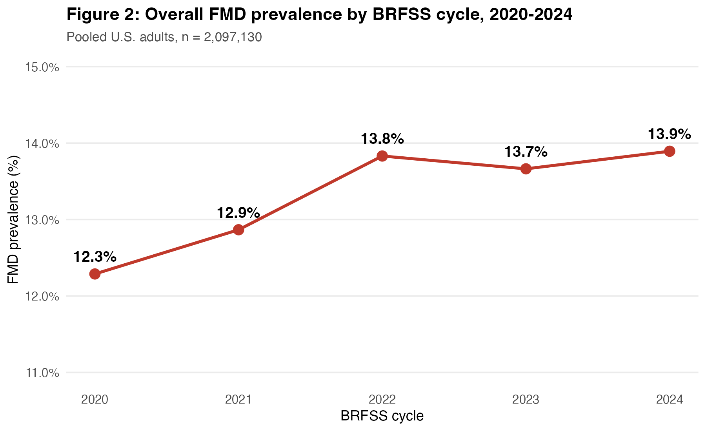{fig-align="center" width="75%"}

- Modest but **consistent upward drift**: 12.3% → 13.9%
- Most of the rise occurred between **2020 and 2022**
- 2023 dipped slightly, but 2024 is the highest of the five years
- Even a 1-pp shift ≈ **2.6 million** more U.S. adults reporting FMD

---

## Figure 3 — Distribution of poor-mental-health days (2024)

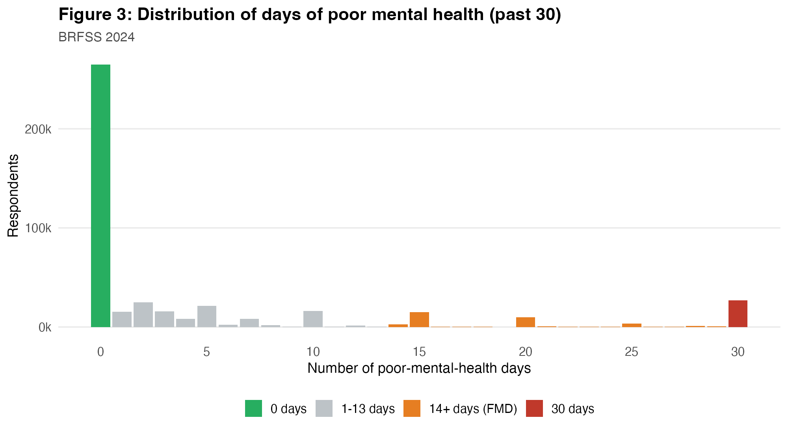{fig-align="center" width="75%"}

- Distribution is **strongly right-skewed and bimodal**
- Most respondents report **0 days**; a nontrivial mass reports **30 days**
- The middle range (5–25 days) is sparse
- Supports dichotomizing at **14 days** — persistent vs. occasional distress

---

## Figure 4a — State ranking, BRFSS 2024

:::: {.columns}
::: {.column width="55%"}
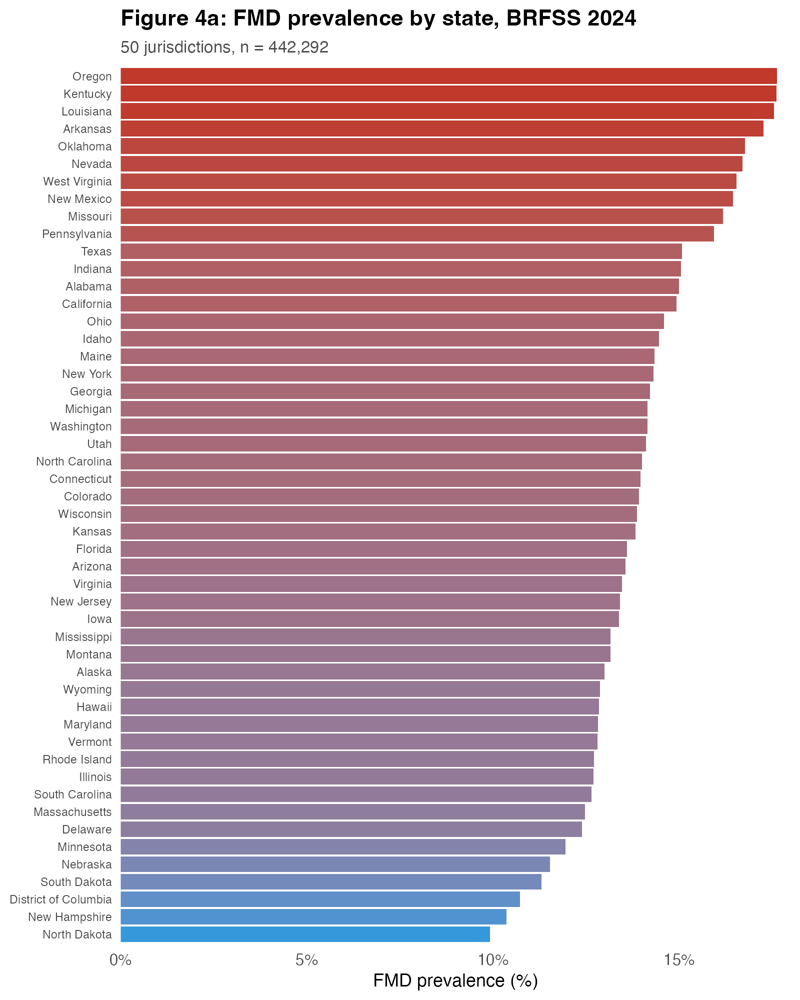{fig-align="center" width="100%"}
:::
::: {.column width="45%"}
- **Highest:** Oregon, Kentucky, Louisiana, Arkansas (≥17%)
- **Lowest:** North Dakota, South Dakota, New Hampshire, DC (≤11%)
- Spread across states: **~7.7 percentage points**
- National average hides **large interstate differences**
:::
::::

---

## Figure 4b — Choropleth map, BRFSS 2024

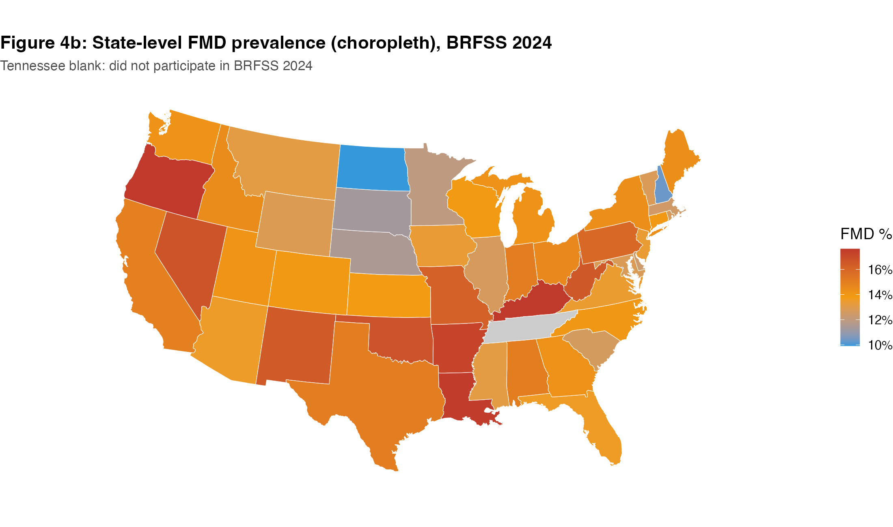{fig-align="center" width="75%"}

- High prevalence concentrated in the **South & Appalachia**
- Low prevalence in the **Upper Midwest & Great Plains**
- Tennessee is blank — did not meet 2024 BRFSS reporting minimums
- Pattern is **geographically structured**, not random

---

## Figure 4c — State × Year heatmap, 2020–2024

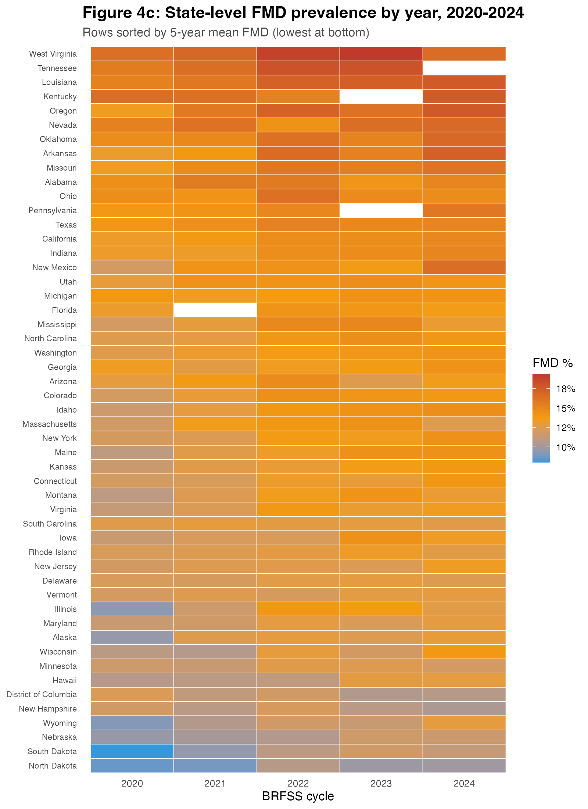{fig-align="center" width="62%"}

- State **ordering is persistent across cycles**
- High-prevalence states tend to stay high; low-prevalence states stay low
- A broader national upward drift shows up **within** most states
- Blank cells = unavailable estimates (e.g., TN 2024, KY & PA 2023)

---

## Figure 5 — Trends by sex and age

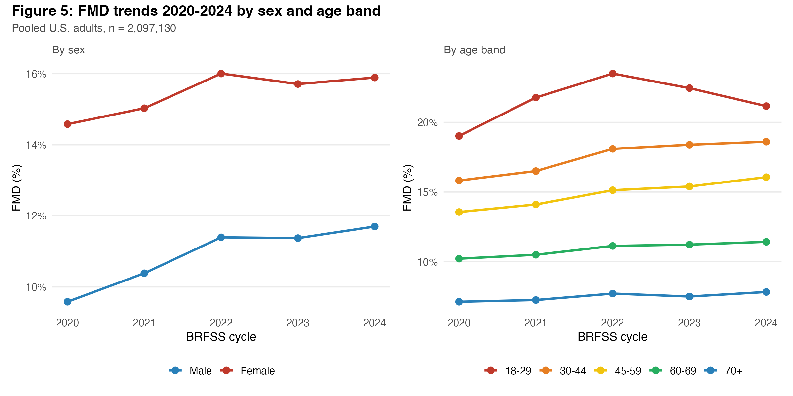{fig-align="center" width="85%"}

- **Women** remain higher than men in every cycle; both trending up
- Age divergence is even sharper:
  - **18–29 adults** drive the steepest increase
  - **70+ adults** stay flat and lowest
- The national rise is largely a **young-adult phenomenon**

---

## Figure 6 — Loneliness and emotional support {.smaller}

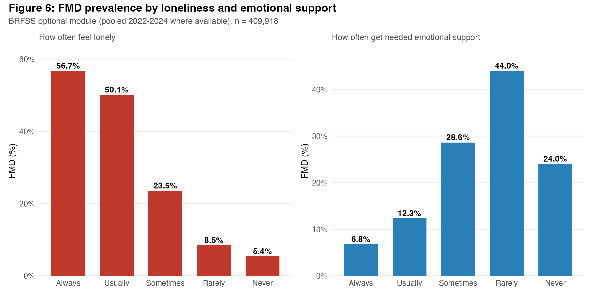{fig-align="center" width="80%"}

- **Loneliness gradient is striking:** 56.7% (Always lonely) → 5.4% (Never)
- **Support gradient mirrors it:** rarely supported → 44.0% FMD
- Among the **strongest correlates** in the entire report
- Optional module — fielded by a subset of jurisdictions (n ≈ 410k)

---

## Figure 7 — Exercise and general health

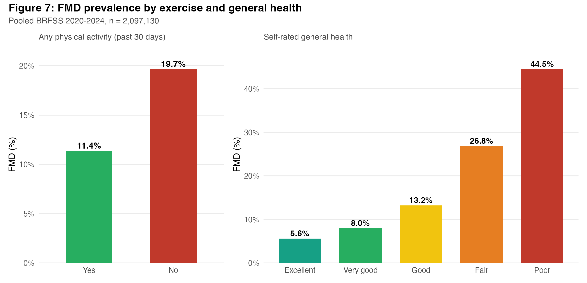{fig-align="center" width="85%"}

- Any recent physical activity → **11.4%** FMD (vs. **19.7%** without)
- Self-rated general health shows a **monotone 5.6% → 44.5%** gradient
- FMD is embedded in a broader pattern of **self-reported ill-being**

---

## Figure 8 — Age, income, education

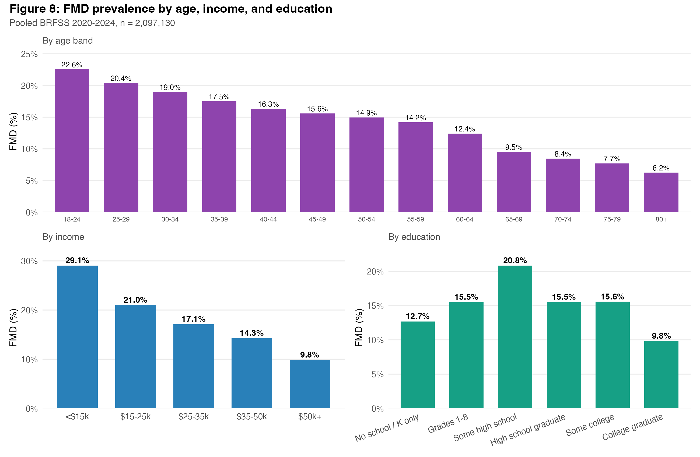{fig-align="center" width="75%"}

- **Age:** 22.6% (18–24) → 6.2% (80+) — strongly monotone
- **Income:** 29.1% (lowest bin) → ≈10% (highest) — steep gradient
- **Education:** lowest among college graduates
- FMD concentrated among **younger, lower-income, less-educated** adults

---

## Figure 9 — Employment status

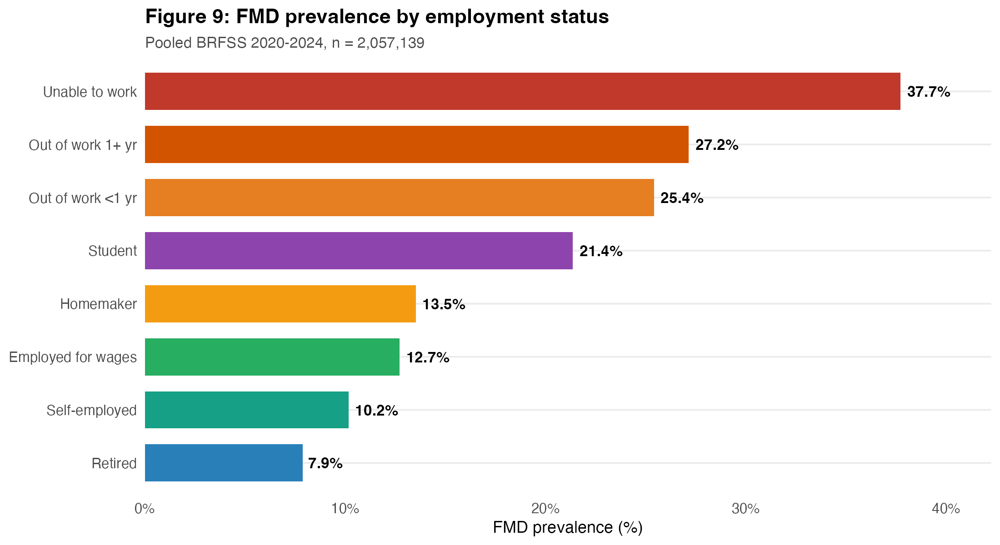{fig-align="center" width="75%"}

- **Unable to work:** 37.7% — highest by a wide margin
- **Out of work** (any duration): 25–27%
- **Retired / self-employed / employed:** 8–13%
- Likely **bidirectional** — distress limits work, joblessness strains mental health

---

## Figure 10 — Marital status

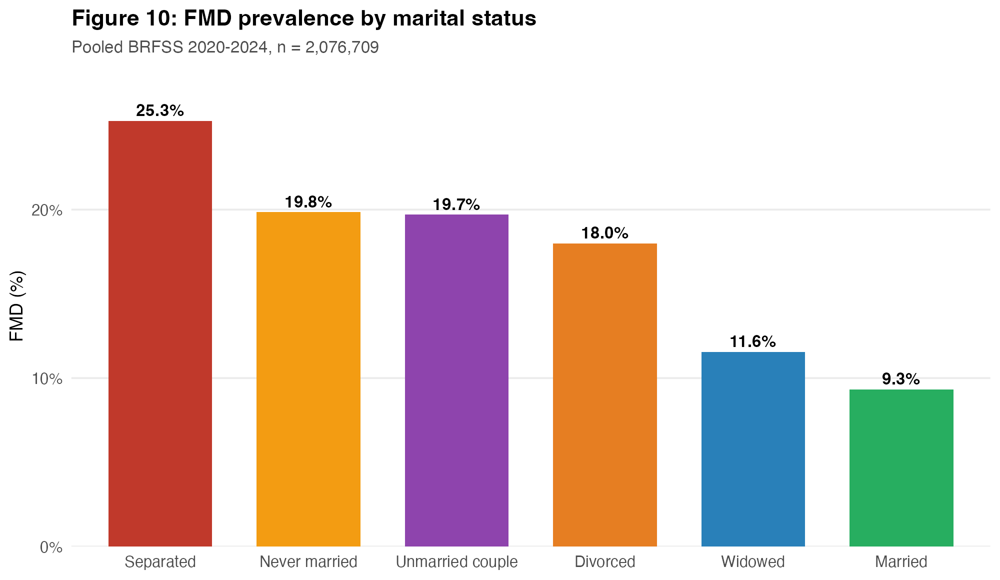{fig-align="center" width="75%"}

- **Separated (25.3%)** and **never-married / divorced (~18–20%)** highest
- **Married (9.3%)** lowest
- Partnership status adds another layer beyond income & employment
- Entangled with age, finances, and transitions — **not causal**

---

## Figure 11 — Smoking status

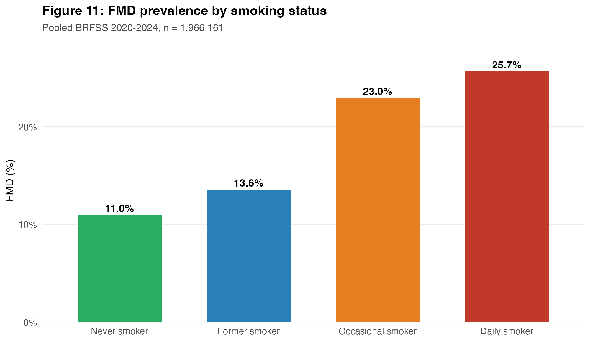{fig-align="center" width="75%"}

- Clear **dose–response** gradient: Never → Former → Occasional → Daily
- **Daily smokers: 25.7%** vs. **Never smokers: 11.0%**
- Reflects co-occurrence, self-medication, and shared upstream risks
- Not causal — cross-sectional association

---

## Figure 12 — Alcohol use

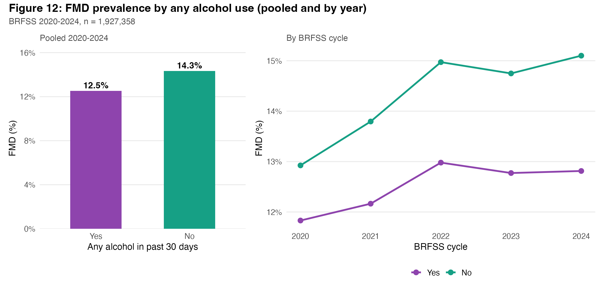{fig-align="center" width="85%"}

- Pooled: **Yes 12.5%** vs. **No 14.3%** — counter-intuitive but consistent across years
- Not evidence that drinking is protective
- **"Sick-quitter" effect:** abstainers over-represent people with chronic illness / prior dependence
- `DRNKANY6` doesn't separate moderate from heavy use

---

## Key Findings

1. **Upward drift, 2020–2024** — small but consistent; driven by younger adults
2. **State variation is large and stable** — highest ≈ 2× lowest; geography is structured
3. **Psychosocial factors dominate** — loneliness and emotional support are the strongest correlates
4. **Socioeconomic inequities persist** — low income, unemployment, separation, low education, and inability to afford care all elevate FMD

---

## Limitations

- **Unweighted** — does not account for BRFSS complex survey design
- **Cross-sectional & self-reported** — descriptive, not causal
- **Optional module** (loneliness, support) fielded by only a subset of jurisdictions
- Some variables (e.g., sleep) not consistently available across cycles
- **Tennessee missing** in 2024

---

## Thank You {.center}

**Questions?**

Boqian Mao · Shuchen Wu
BIOSTAT 620 Final Project, April 2026

Full interactive report:
*alfie0925.github.io/biostat620-final-project*
